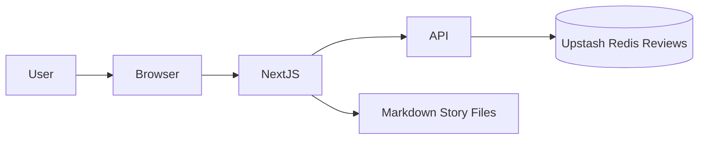
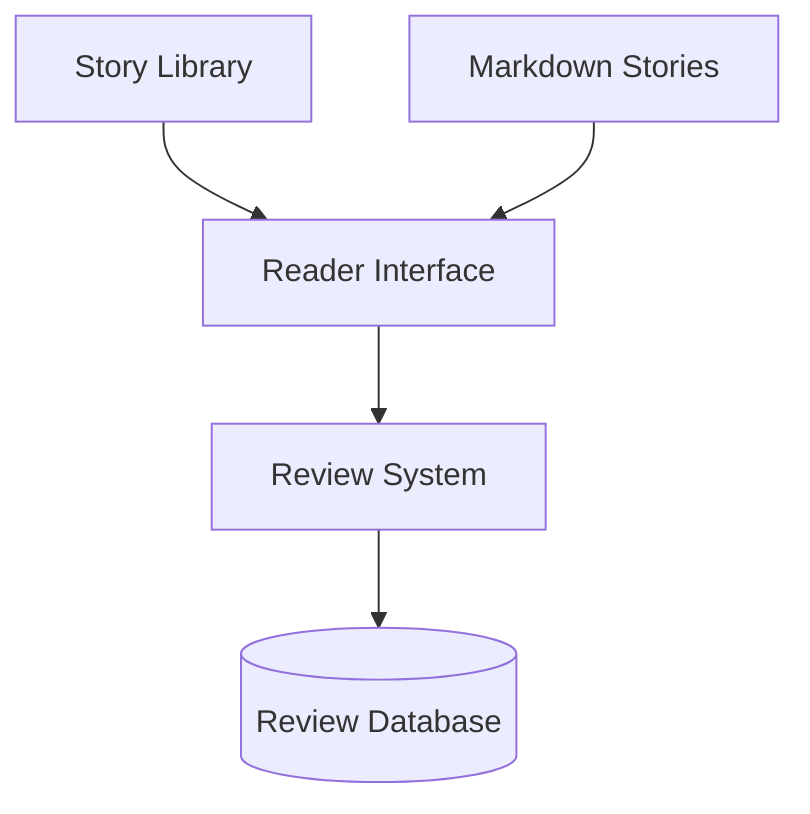

<!--
Project: Eclipse
Owned by Zorvia
All credits to the Zorvia Community
Licensed under ZPL v2.0 — see LICENSE.md
-->

<h1 align="center">Eclipse</h1>

<p align="center">
A modern digital short-story library designed for immersive reading, elegant discovery, and community reviews.
</p>

<p align="center">


</p>

<p align="center">

**Live Platform**

https://eclipselib.vercel.app

</p>

---

# Architecture



Eclipse is built using a modern **serverless architecture** designed for performance and scalability.

Frontend rendering, API routes, and story rendering are unified through **Next.js** and deployed globally using **Vercel**.

---

# System Overview

Eclipse provides a complete reading platform where users can:

* browse a searchable story library
* open an immersive reading interface
* adjust typography and layout preferences
* track reading progress
* submit and browse reviews
* discover stories through tags and filters

The project focuses on **reader comfort, accessibility, and maintainability**.

---

# Feature Architecture



---

# Core Features

## Story Library

The homepage provides a responsive grid of stories.

Capabilities include:

* instant search
* tag filtering
* cover previews
* sorting by newest or rating
* featured story support

---

## Reader Interface

The reader is optimized for long-form reading.

Available controls include:

* adjustable font size
* narrow and wide reading widths
* dark and light themes
* reading progress indicator
* automatic reading position saving
* keyboard navigation
* mobile swipe gestures

Typography uses a tuned scale for optimal readability.

---

## Community Review System

Each story includes a persistent review section.

Users can:

* submit 1–5 star ratings
* write textual reviews
* sort by newest or highest rated
* view aggregated ratings and review counts

---

# API

Retrieve reviews

```
GET /api/reviews?storyId=...&sort=newest|highest
```

Submit a review

```
POST /api/reviews
```

Delete a review

```
DELETE /api/reviews/:id
```

Admin deletion requires the `x-admin-token` header.

Example:

```bash
curl -X DELETE https://eclipselib.vercel.app/api/reviews/REVIEW_ID \
  -H "x-admin-token: YOUR_ADMIN_TOKEN"
```

---

# Story Authoring

Stories are written as **Markdown documents** stored in the repository.

Example story structure:

```yaml
---
id: "example-story"
title: "Example Story"
author: "Zorvia"
date: "2026-03-10"
cover: "assets/covers/example.svg"
description: "Short description of the story."
tags: ["fiction"]
---

Story content begins here.
```

Stories are placed in the `stories/` directory and rendered dynamically by the reader.

---

# Development

Clone the repository and start the development server.

```bash
git clone https://github.com/Zorvia/Eclipse.git
cd Eclipse
npm ci
npm run dev
```

Open

```
http://localhost:3000
```

---

# Project Structure

```
Eclipse
│
├─ app
├─ components
├─ stories
├─ public
├─ assets
├─ api
├─ data
│
├─ LICENSE.md
├─ README.md
└─ CHANGELOG.md
```

---

# Environment Variables

| Variable                 | Purpose                |
| ------------------------ | ---------------------- |
| UPSTASH_REDIS_REST_URL   | Redis endpoint         |
| UPSTASH_REDIS_REST_TOKEN | Redis authentication   |
| REVIEW_ADMIN_TOKEN       | Admin moderation token |
| RATE_LIMIT_PER_MINUTE    | Review rate limiting   |

If Redis is not configured, reviews fall back to local JSON storage.

---

# Continuous Integration

Validation commands

```
npm run validate:headers
npm run lint
npm run test
npm run build
```

CI workflow

```
.github/workflows/ci.yml
```

---

# Deployment

The production deployment is hosted on **Vercel**.

```
https://eclipselib.vercel.app
```

Every push to `main` triggers an automatic deployment.

---

# License

This project is licensed under **ZPL v2.0**.

See `LICENSE.md` for the full license text.

---

# Credits

Owned by **Zorvia**

All credits belong to the **Zorvia Community**
